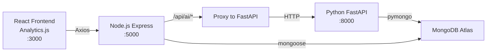

# AI/ML Analytics Module — Implementation Plan

Upgrade the existing Analytics page with AI/ML predictions powered by a Python FastAPI microservice.

## Architecture Overview



> [!IMPORTANT]
> All AI features are integrated into the **existing `/analytics` route and `Analytics.js` page**. No new pages, routes, or sidebar items are created. The existing Analytics page will be rebuilt with both the original analytics + new AI-powered sections.

---

## Proposed Changes

### Component 1 — Python FastAPI ML Service

All files live under `backend/AI/`.

#### [NEW] [requirements.txt](file:///c:/Users/Vihar/Desktop/projectMCA/backend/AI/requirements.txt)

```
fastapi
uvicorn
pymongo
pandas
numpy
scikit-learn
joblib
python-dotenv
```

> [!NOTE]
> We use **scikit-learn** (Linear Regression, Random Forest) instead of Prophet. Lighter dependencies, easier Windows install, and more than sufficient for an MCA project.

#### [NEW] [app.py](file:///c:/Users/Vihar/Desktop/projectMCA/backend/AI/app.py)

FastAPI application with endpoints:

| Endpoint | Method | Description |
|---|---|---|
| `/health` | GET | Health check |
| `/train` | POST | Train all ML models from MongoDB data |
| `/sales-prediction` | GET | Tomorrow / 7-day / 30-day sales forecast |
| `/demand-forecast` | GET | Per-product demand prediction (top 10) |
| `/restock` | GET | AI restock recommendations |
| `/stockout` | GET | Days-until-stockout per product |
| `/fast-moving` | GET | Fast/Medium/Slow classification |
| `/profit` | GET | Monthly profit prediction |
| `/supplier` | GET | Supplier recommendation with scores |
| `/dashboard` | GET | Aggregated dashboard data (calls all above) |

Auto-trains models on startup if no `.pkl` files exist.

#### [NEW] [train.py](file:///c:/Users/Vihar/Desktop/projectMCA/backend/AI/train.py)

Training module — connects to MongoDB, aggregates data, trains models:

| Model | Algorithm | Training Data |
|---|---|---|
| Sales Forecaster | Linear Regression | Daily `grandTotal` from `sales` collection |
| Demand Forecaster | Random Forest Regressor | Per-product daily `quantitySold` |
| Profit Predictor | Linear Regression | Monthly revenue vs purchase totals |

Features for Sales Forecaster: `day_of_week`, `day_of_month`, `month`, `day_index`, `rolling_7day_avg`

Saves models as `.pkl` files via `joblib`.

#### [NEW] [predict.py](file:///c:/Users/Vihar/Desktop/projectMCA/backend/AI/predict.py)

Prediction module:

1. **Sales Prediction** — tomorrow, next 7 days, next 30 days
2. **Demand Forecast** — per-product predicted daily demand, top 10
3. **Restock** — `recommended_qty = max(predicted_demand_30d + safety_stock - current_stock, 0)`
4. **Stock-Out** — `days_remaining = current_stock / avg_daily_sales`
5. **Fast/Medium/Slow** — percentile-based classification on last 90 days sales
6. **Profit Prediction** — next month revenue & profit estimate
7. **Supplier Recommendation** — weighted scoring (40% price, 30% delivery, 30% rating)
8. **Inventory Health Score** — composite 0–100 based on low stock, dead stock, turnover, sales trend

---

### Component 2 — Node.js Proxy Layer

#### [NEW] [aiController.js](file:///c:/Users/Vihar/Desktop/projectMCA/backend/controllers/aiController.js)

Uses `fetch` to proxy requests to FastAPI at `http://localhost:8000`. Falls back gracefully if FastAPI is down.

#### [NEW] [aiRoutes.js](file:///c:/Users/Vihar/Desktop/projectMCA/backend/routes/aiRoutes.js)

```
GET  /api/ai/dashboard         → FastAPI /dashboard
GET  /api/ai/sales-prediction  → FastAPI /sales-prediction
GET  /api/ai/restock           → FastAPI /restock
GET  /api/ai/stockout          → FastAPI /stockout
GET  /api/ai/profit            → FastAPI /profit
GET  /api/ai/fast-moving       → FastAPI /fast-moving
GET  /api/ai/supplier          → FastAPI /supplier
POST /api/ai/train             → FastAPI /train
```

All protected with JWT `protect` middleware.

#### [MODIFY] [server.js](file:///c:/Users/Vihar/Desktop/projectMCA/backend/server.js)

Add:
```js
const aiRoutes = require("./routes/aiRoutes");
app.use("/api/ai", aiRoutes);
```

---

### Component 3 — Rebuild Analytics Page

#### [MODIFY] [Analytics.js](file:///c:/Users/Vihar/Desktop/projectMCA/frontend/src/pages/Analytics.js)

Completely rebuild the existing Analytics page to include both original analytics AND all AI features. The page will have **tabbed sections**:

**Tab 1: Overview** (existing analytics + AI KPIs)
- **AI KPI Cards Row** — 8 gradient cards:
  - Today's Sales (actual from existing API)
  - Tomorrow's Prediction ✨ (AI)
  - Weekly Prediction ✨ (AI)
  - Monthly Prediction ✨ (AI)
  - Expected Profit ✨ (AI)
  - Products to Restock ✨ (count)
  - Stock-Out Alerts ✨ (count)
  - Inventory Health Score ✨ (0–100 with circular gauge)
- **Sales Trend + AI Forecast Chart** — AreaChart showing actual daily sales (solid line) + AI predicted future (dashed line with different color)
- **Daily Sales vs Purchase Chart** — existing chart (preserved)

**Tab 2: AI Forecasts**
- **Demand Forecast Bar Chart** — top 10 products: current daily avg vs AI predicted demand
- **Profit Forecast Line Chart** — historical monthly profit + AI predicted next months
- **Stock-Out Risk Bar Chart** — horizontal bars showing days until stock-out per product (red/amber/green zones)

**Tab 3: AI Insights**
- **Fast vs Slow Moving Pie Chart** — Fast/Medium/Slow distribution
- **Restock Recommendations Table** — product, current stock, predicted demand, safety stock, recommended qty, supplier
- **Supplier Recommendations Table** — supplier name, AI score, price rank, delivery speed, explanation
- **Top Products** — preserved from existing

**Design:**
- Uses existing Tailwind colors (`primary`, `accent-indigo`, `accent-emerald`, etc.)
- Tab switcher with pill-style buttons
- ✨ sparkle badge on AI-powered cards/sections
- Glass morphism cards matching existing style
- Circular health gauge (SVG-based)
- Responsive grid layout
- Smooth `animate-fade-in` transitions
- Month selector preserved for original analytics data

No changes needed to `App.js`, `Layout.js`, or sidebar — the `/analytics` route and menu item already exist.

---

### Component 4 — Supplier Model Update

#### [MODIFY] [Supplier.js](file:///c:/Users/Vihar/Desktop/projectMCA/backend/models/Supplier.js)

Add two fields needed for the recommendation engine:
```js
rating: { type: Number, default: 3, min: 1, max: 5 },
deliveryTimeDays: { type: Number, default: 7 }
```

---

### Component 5 — Historical Data Seeder

#### [NEW] [seedSalesHistory.js](file:///c:/Users/Vihar/Desktop/projectMCA/backend/seedSalesHistory.js)

> [!IMPORTANT]
> ML models need historical data. This seeder generates **6 months of realistic sales history** using existing products from MongoDB. It creates daily sales records with randomized quantities, proper GST, and monthly purchase records for profit analysis. **Does not delete existing data** — only adds.

Also updates existing suppliers with `rating` and `deliveryTimeDays` values.

---

## Open Questions

> [!IMPORTANT]
> **Python**: Do you have Python 3.8+ installed? Run `python --version` to check. Needed for the FastAPI ML service.

---

## Execution Order

| Step | Action | Files |
|---|---|---|
| 1 | Create Python FastAPI ML service | `AI/requirements.txt`, `AI/app.py`, `AI/train.py`, `AI/predict.py` |
| 2 | Update Supplier model | `models/Supplier.js` |
| 3 | Create historical data seeder + seed data | `seedSalesHistory.js` |
| 4 | Create Node.js proxy layer | `controllers/aiController.js`, `routes/aiRoutes.js` |
| 5 | Register AI routes in server.js | `server.js` |
| 6 | Rebuild Analytics page with AI features | `pages/Analytics.js` |
| 7 | Install Python deps, train models, verify | Runtime |
